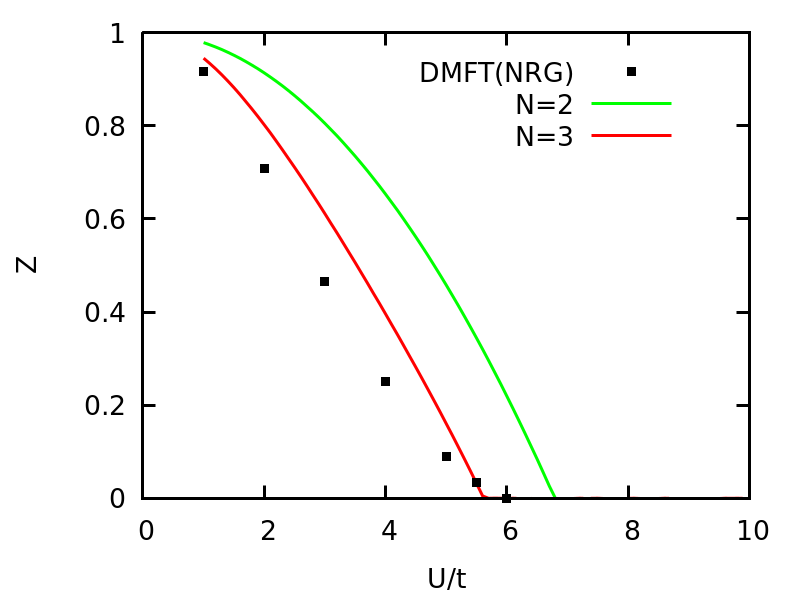

# VDATN3multi.jl

## Tutorial

### Include vdat.jl 
To start with, include the vdat.jl. The following code assumes current path is <path_to_VDATN3multi>/src/example/
https://github.com/chengzhengqian/VDATN3multi.jl/blob/8afb25f6b68dfad11e288ed0479c6095f79ed17c/src/example/example_one_band_half.jl#L3

### One band example
To start with, let's solve the one band Hubbard on a d=\infty Bethe lattice. There are two modes to work with, the fixed density mode and the free density mode. In fixed density mode, one can specify the density for each spin orbital, and VDAT automatically constrains the variational parameters to satifies the given densities. For example, it is useful to examine the half-filling case, which exhibits the metal-insulator transition at some critical U.
To perform the VDAT calculation, we need to build an instance of Model, which can be created with create_model.
https://github.com/chengzhengqian/VDATN3multi.jl/blob/8afb25f6b68dfad11e288ed0479c6095f79ed17c/src/example/example_one_band_half.jl#L5-L15

This is the typical way how we construct the model, so we examine the above code line-by-line. N_spin_oribital_ specifies the number of spin-oribtals of the model. We normally label these spin orbitals from 1 to N_spin_orbital_. The variable symmetry_ defines the symmetry of the model, which has the form like [symmetry_group1,symmetry_group2,..,symmetry_groupN] where symmetry_groupi=[spin_orb_1,spin_orb_2,..spin_orb_M]. Each entry of symmetry_ is array of the index of spin-orbitals which have permutation symmetry within themselves. The variable n_target_ has the form [n_group1, n_group2,..,n_groupN], which must has the same length as  as symmetry_, and specify the density per spin orbital within each symmetry group. Correspondingly, for each symmetry group, we can also specify the density of states D(e). To parametrize D(e), one can sample the energies from D(e) and store them ascendingly in a file, which can be loaded by gene_spline_band. Finally, the two body interaction is specified by the variable interaction_ which is a array of tuple and has the form like [(i,j,Uij)...], where i,j are the index of two different spin-orbitals and each tuple corresponds a interaction like Uij * ni * nj. Similarly, the one body interaction is specified by the chemical_potential_, which has the form like [(i,mui)...], and each tuple corresponds a term like -mui * ni.

Once we create the model, we can use get_para and set_para to view and write the variational parameters. Furthermore, function compute will evaluation the total energy and other observables for the given variational parameters. All observables can be read from model.obs, or using @get_obs macro.

https://github.com/chengzhengqian/VDATN3multi.jl/blob/8afb25f6b68dfad11e288ed0479c6095f79ed17c/src/example/example_one_band_half.jl#L18-L36

While we focus for VDAT N=3, we also implement N=2 (equivalent to the well-known Gutzwiller approximation) using the same interface. One can simply set N_time_step=2 when creating the model, and remaining part is almost identical (The exception is that one get fewer observables in model.obs in N=2). It should be noted that N=2 and N=3 has almost same cost for multi-orbital case, but N=3 yields superior results for the whole parameter space by construbtion (i.e variational principle). So unless for benchmark, one should always use N=3.

https://github.com/chengzhengqian/VDATN3multi.jl/blob/8afb25f6b68dfad11e288ed0479c6095f79ed17c/src/example/example_one_band_half.jl#L41-L43

Now, we can easily solve this canonical model with N=2 and N=3 on a dense grid of U within seconds, and it is exciting to see the results.
We use gnuplot to generate images.
Using following commands, we can plot the double occupancy vs U and compare the VDAT results to DMFT with NRG solver.

https://github.com/chengzhengqian/VDATN3multi.jl/blob/26728971e324dda063be6e02f1ee6f577dcebf78/src/example/plot_one_band_half.gnuplot#L11-L15

The double occupancy vs U for one Hubbard model at half-filling on d=\infty Bethe lattice

Using following commands, we can plot the quasi-particle weight Z vs U and compare the VDAT results to DMFT with NRG solver.

https://github.com/chengzhengqian/VDATN3multi.jl/blob/26728971e324dda063be6e02f1ee6f577dcebf78/src/example/plot_one_band_half.gnuplot#L24-L28

The quasi-particle weight Z vs U for one Hubbard model at half-filling on d=\infty Bethe lattice

