# VDATN3multi.jl

## Tutorial
### Intructions to run the examples
All examples to run VDAT and scripts to generate plots are located in <path_to_VDATN3multi>/src/example/.
The following code snippets may be outdated, please refer to the lastest version of the code to find the correct usage.
### Include vdat.jl 
To start with, include the vdat.jl. The following code assumes current path is <path_to_VDATN3multi>/src/example/
https://github.com/chengzhengqian/VDATN3multi.jl/blob/8afb25f6b68dfad11e288ed0479c6095f79ed17c/src/example/example_one_band_half.jl#L3

### One-band Hubbard model at half-filling
To start with, let's solve the one band Hubbard on a d=\infty Bethe lattice. There are two modes to work with, the fixed density mode and the free density mode. In fixed density mode, one can specify the density for each spin orbital, and VDAT automatically constrains the variational parameters to satify the given densities. For example, we start with half-filling case, which exhibits the metal-insulator transition at some critical U.
To perform the VDAT calculation, we need to build an instance of Model, which can be created with create_model.
https://github.com/chengzhengqian/VDATN3multi.jl/blob/8afb25f6b68dfad11e288ed0479c6095f79ed17c/src/example/example_one_band_half.jl#L5-L15

This is the typical way how we construct the model, so we examine the above code line-by-line. N_spin_oribital_ specifies the number of spin-oribtals of the model. We normally label these spin orbitals from 1 to N_spin_orbital_. The variable symmetry_ defines the symmetry of the model, which has the form like [symmetry_group1,symmetry_group2,..,symmetry_groupN] where symmetry_groupi=[spin_orb_1,spin_orb_2,..spin_orb_M]. Each entry of symmetry_ is array of the index of spin-orbitals which have permutation symmetry within themselves. The variable n_target_ has the form [n_group1, n_group2,..,n_groupN], which must has the same length as  as symmetry_, and specify the density per spin orbital within each symmetry group. Correspondingly, for each symmetry group, we can also specify the density of states D(e). To parametrize D(e), one can sample the energies from D(e) and store them ascendingly in a file, which can be loaded by gene_spline_band. Finally, the two body interaction is specified by the variable interaction_ which is a array of tuple and has the form like [(i,j,Uij)...], where i,j are the index of two different spin-orbitals and each tuple corresponds a interaction like Uij * ni * nj. Similarly, the one body interaction is specified by the chemical_potential_, which has the form like [(i,mui)...], and each tuple corresponds a term like -mui * ni.

Once we create the model, we can use get_para and set_para to view and write the variational parameters. Furthermore, function compute will evaluation the total energy and other observables for the given variational parameters. All observables can be read from model.obs, or using @get_obs macro.

https://github.com/chengzhengqian/VDATN3multi.jl/blob/8afb25f6b68dfad11e288ed0479c6095f79ed17c/src/example/example_one_band_half.jl#L18-L36

While we focus for VDAT N=3, we also implement N=2 (equivalent to the well-known Gutzwiller approximation) using the same interface. One can simply set N_time_step=2 when creating the model, and remaining part is almost identical (The exception is that one get fewer observables in model.obs in N=2). It should be noted that N=2 and N=3 has almost same cost for multi-orbital case, but N=3 yields superior results for the whole parameter space by construbtion (i.e variational principle). So unless for benchmark, one should always use N=3.

https://github.com/chengzhengqian/VDATN3multi.jl/blob/8afb25f6b68dfad11e288ed0479c6095f79ed17c/src/example/example_one_band_half.jl#L41-L43

Now, we can easily solve this canonical model with N=2 and N=3 on a dense grid of U within seconds, and it is exciting to see the results.
We use gnuplot to generate images.
Using following commands, we can plot the double occupancy vs U and compare the VDAT results to DMFT with NRG solver.

https://github.com/chengzhengqian/VDATN3multi.jl/blob/26728971e324dda063be6e02f1ee6f577dcebf78/src/example/plot_one_band_half.gnuplot#L11-L15

The double occupancy vs U for one Hubbard model at half-filling on d=\infty Bethe lattice

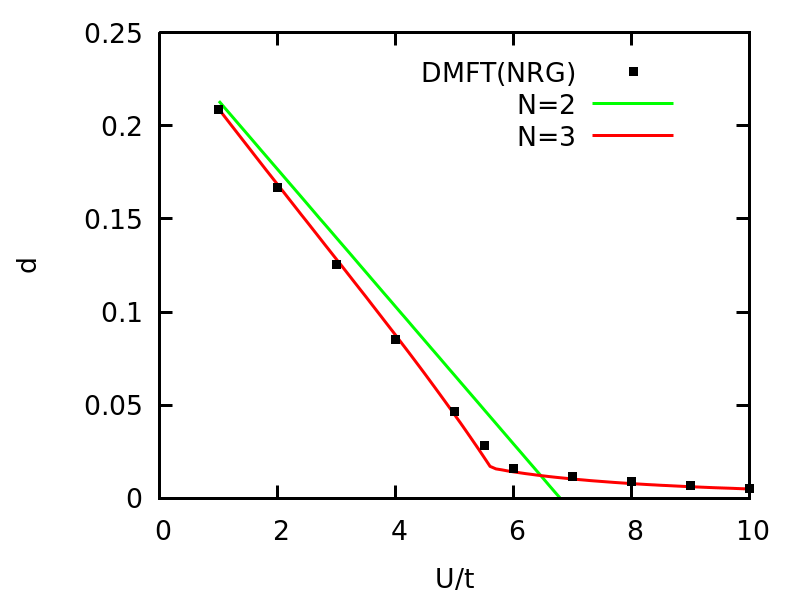

Using following commands, we can plot the quasi-particle weight Z vs U and compare the VDAT results to DMFT with NRG solver.

https://github.com/chengzhengqian/VDATN3multi.jl/blob/26728971e324dda063be6e02f1ee6f577dcebf78/src/example/plot_one_band_half.gnuplot#L24-L28

The quasi-particle weight Z vs U for one Hubbard model at half-filling on d=\infty Bethe lattice

### One-band Hubbard model at fixed density 

One can simiply change n_target_ to solve the model at a given density (no magnetization). To simplify the process of generating data, we define the following functions:

https://github.com/chengzhengqian/VDATN3multi.jl/blob/11f62b594927baafa31c4e8c48cdb3915640d8e7/src/example/example_one_band_doped.jl#L12-L33

Then we could generate the solutions for a range of U and density as:

https://github.com/chengzhengqian/VDATN3multi.jl/blob/11f62b594927baafa31c4e8c48cdb3915640d8e7/src/example/example_one_band_doped.jl#L36-L47

One can similarly perform the N=2 calculation. Finally, we check the double occupancy vs U using N=2 and N=3 and compare the result to DMFT(NRG).

### One-band Hubbard model at given chemical potential
It is also useful to solve the model at given chemical potential instead of given density. 

https://github.com/chengzhengqian/VDATN3multi.jl/blob/7677f3ff5869eff081eccb196bd7f80de04a46c4/src/example/example_one_band_free.jl#L9-L21

Especially, one should pay attention to 
https://github.com/chengzhengqian/VDATN3multi.jl/blob/7677f3ff5869eff081eccb196bd7f80de04a46c4/src/example/example_one_band_free.jl#L19
which sets the model without any density constraint and pass a function named as cal_Eeff_U, which takes N_Ueff number of parameters to describe interacting projectors.

The main purpose to introduce cal_Eeff is that for multi-orbital system, the number of variational parameters for interacting projectors grows exponentially with number of orbitals, and therefore, it is useful to let users to define customized ways to parametrize the interacting projectors. For example, cal_Eeff_U is defined as 
https://github.com/chengzhengqian/VDATN3multi.jl/blob/7677f3ff5869eff081eccb196bd7f80de04a46c4/src/w_free.jl#L168-L185

The signature of cal_Eeff is (Γασ,μeffασ,Ueff_para), where Γασ is the atomic configuration, μeffασ is a rray of effective chemical potentials to control the densities, and Ueff_para is a array of effective interacting parameters to control the local correlations. cal_Eeff_U will become the Gutzwiller projector in the one-band case, and the probabilty of Γασ is proportional to exp(-cal_Eeff(Γασ,μeffασ,Ueff_para)). We also define 

https://github.com/chengzhengqian/VDATN3multi.jl/blob/7677f3ff5869eff081eccb196bd7f80de04a46c4/src/w_free.jl#L122

to define the Jastrow projector when we have both U and J in multi-orbital case. It should be notes that N_Ueff is fixed for a given parametrization and must be passed to the model as illustrated above.

Now, we could solve the model with various chemical potentials at given U.
First, it is useful to double-check results with the fixed density approach. We can set chemical potential as U/2, and compute density deviation from 0.5.

https://github.com/chengzhengqian/VDATN3multi.jl/blob/4af70df37654968e7d4ac92066b16049a98df2c6/src/example/example_one_band_free.jl#L38-L48

The density deviation (i.e, n-0.5) vs U for one band Hubbard model using half-filling chemical potential.

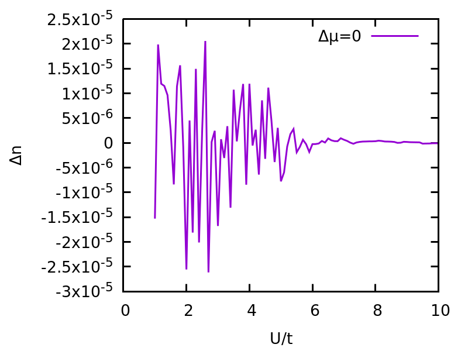

One can understand that the deviation from the exact density is due to the error of numerical minization, and therefore, should relates to how the energy responses to the density deviation. For metal phase, energy is quadratic in density deviation while in insulating phase, it is linear in the absoluate value of density deviation. Therefore, we expect larger density deviation for the metal phase.

One can also check that two approaches produce the same double occupancy vs U plot:

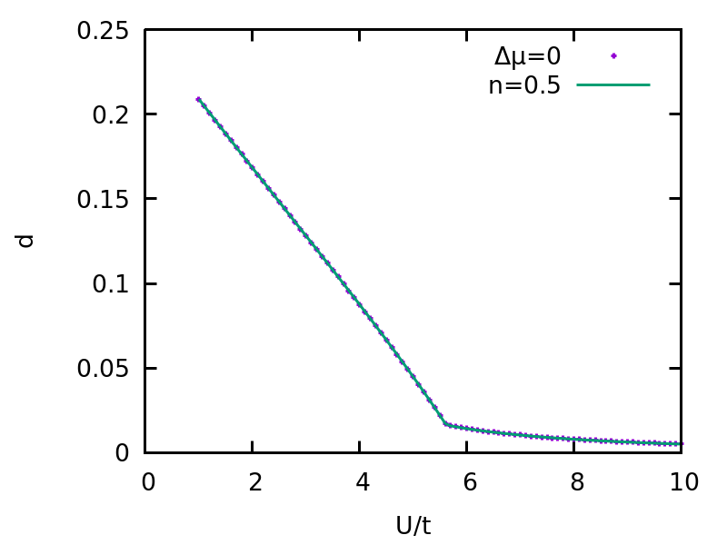

Next, We start from half-filling parameters and increase chemical potential.

https://github.com/chengzhengqian/VDATN3multi.jl/blob/7677f3ff5869eff081eccb196bd7f80de04a46c4/src/example/example_one_band_free.jl#L70-L84

And we can plot the density as a function of chemical potential for U=1.0,2.0,...,9.0 

The density as a function of chemical potential for U=1.0,2.0,...,9.0 for one-band Hubbard model. N=3(reverse) means that the calculation starts from a doped regime and decrease the chemical potential, while N=3 means the calculation starts from half-filling and increase the chemical potential.

### One-band model at given magnetic field

Similar to the case with given chemical potential, we can solve the model at a given magnetic field.

https://github.com/chengzhengqian/VDATN3multi.jl/blob/c3e0a1b64ecee3c148de2e20cd941e6a85f0e195/src/example/example_one_band_magnetic_field.jl#L8-L20

Here, we set chemical_potential_=[(1,U/2+B),(2,U/2-B)] so the total density is 1.
We first check the results for B=0, which should yield n_up=n_dn=0.5. So we can plot the deviations of the dnesity for each spin orbital from the exact value.

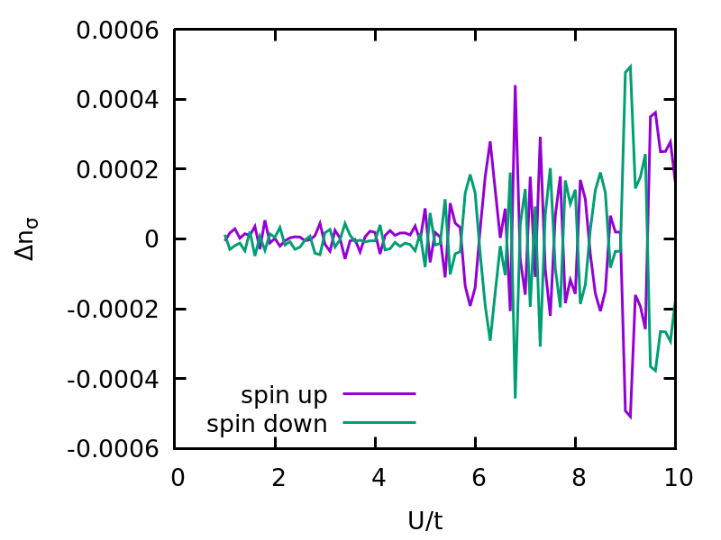

We can also plot the deviation of the total density and magnetization from the exact value.

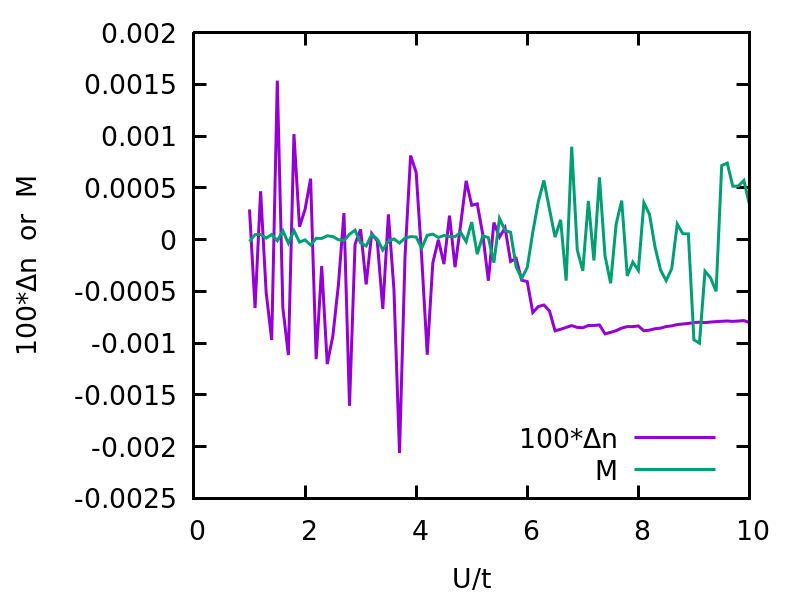

We can see the amplitude of deviations relates to the susceptibility of corresponding observables.

We can also check the double occupancy vs U/t with the fixed density approach.

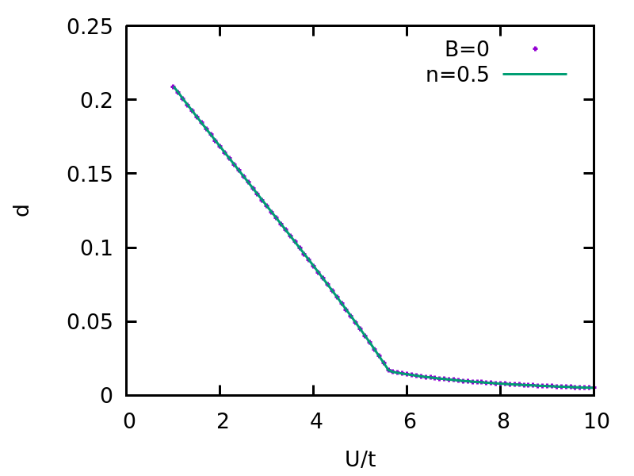

Finally, we can plot the magnetization vs B/t for various U. Here, we assume the magnetic field B coupldes to the system as -B*(n_up-n_dn) and the magnetization M is defined as M=n_up-n_dn

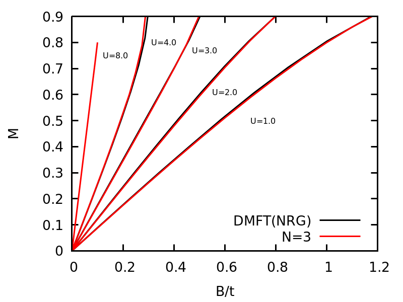

### Two-band Hubbard model at half-filling and orbital selective Mott transition
It is straightforward to generalize the above code to solve the multi-orbital problem. However, one should use more sophisticated parametrization of the local projector to ensure an efficient minimization. Based on experience, it turns out using Jastrow-like projector is much more stable than the fluctuation based projectors (the default way). In this part, we use a two-orbital Hubbard model to illustrate the ideas.

https://github.com/chengzhengqian/VDATN3multi.jl/blob/da50ddd6feebc176661328edee9e37690b75c4e2/src/example/example_two_band_half.jl#L29-L43

Notice we should pass the following options to create_model: w_mode="fix",N_w_para_fixed=3,cal_w_fixed=cal_w_fixed_two_band_half
The key function is cal_w_fixed_two_band_half, which is defined as 

https://github.com/chengzhengqian/VDATN3multi.jl/blob/da50ddd6feebc176661328edee9e37690b75c4e2/src/example/example_two_band_half.jl#L8-L12

In general, one should pass a function with signature (neffασ,w_para) -> w, where neffασ=(n1,n2,...,n_N_spin_orb) and the return value w should be constrained by neffασ. In addition, one should pass N_w_para_fixed, which is the size of w_para.

Now, we can solve a two-band Hubbard model with t1 and t2 as the hopping parameters for the first and second band.

To probe the metal insulator transition, we plot the quasi-particle weights for the two bands vs U.

t1/t2="0.2 0.3 0.4 0.5 0.6 0.7 0.8 0.9 1.0"
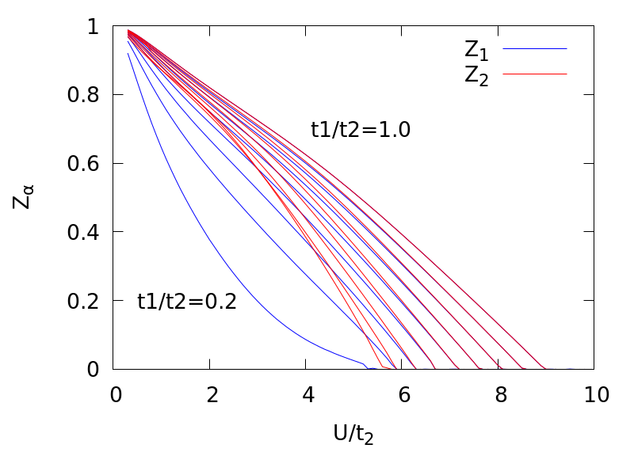

t1/t2="0.2 0.21 0.22 0.23 0.24 0.25 0.26 0.27 0.28 0.29 0.3"
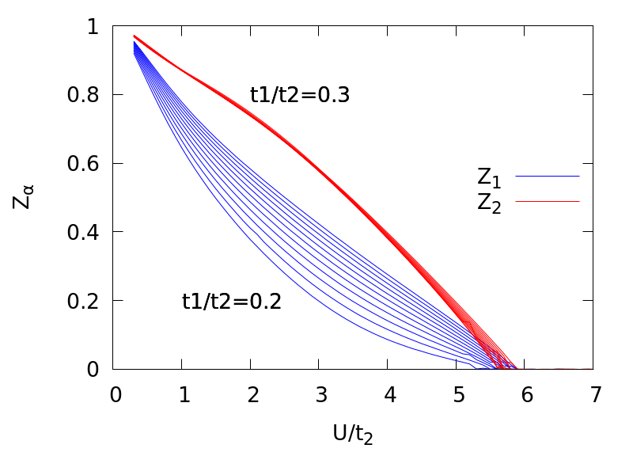

t1/t2="0.1 0.11 0.12 0.13 0.14 0.15 0.16 0.17 0.18 0.19 0.2"
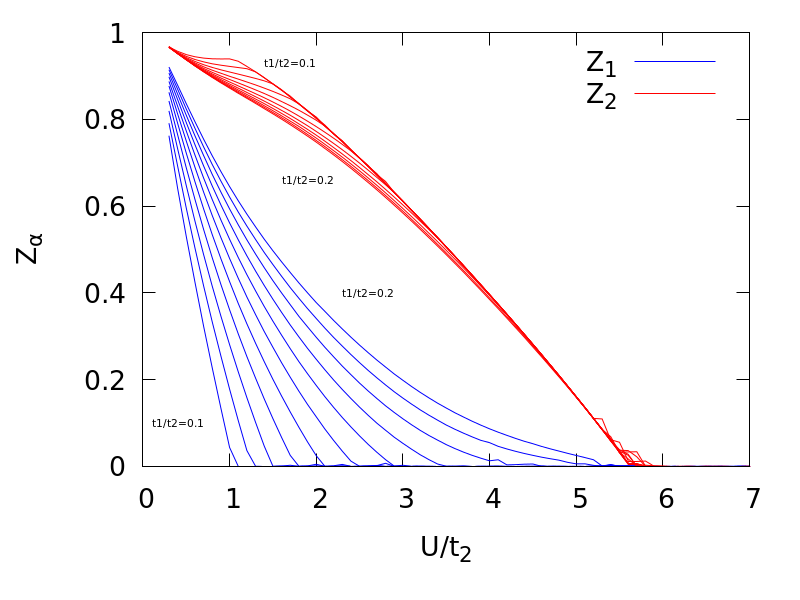

Interestingly, we find that for t1/t2 >=0.25, two bands simultaneously enter the Mott phase, where for t1/t2 <=0.25, two bands have two different transition values and the difference between two values increases when t1/t2 decreases.

We can also gain insights by inspecting the density-density correlation for different t1/t2.

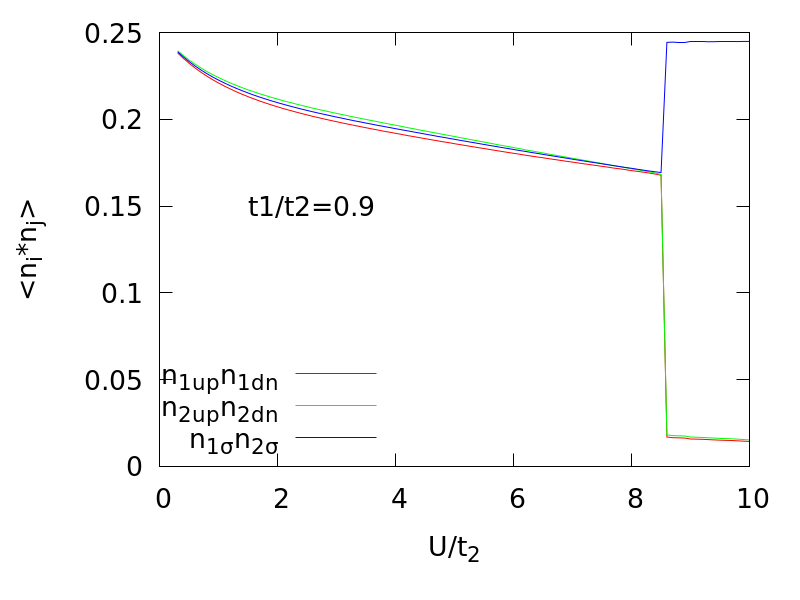
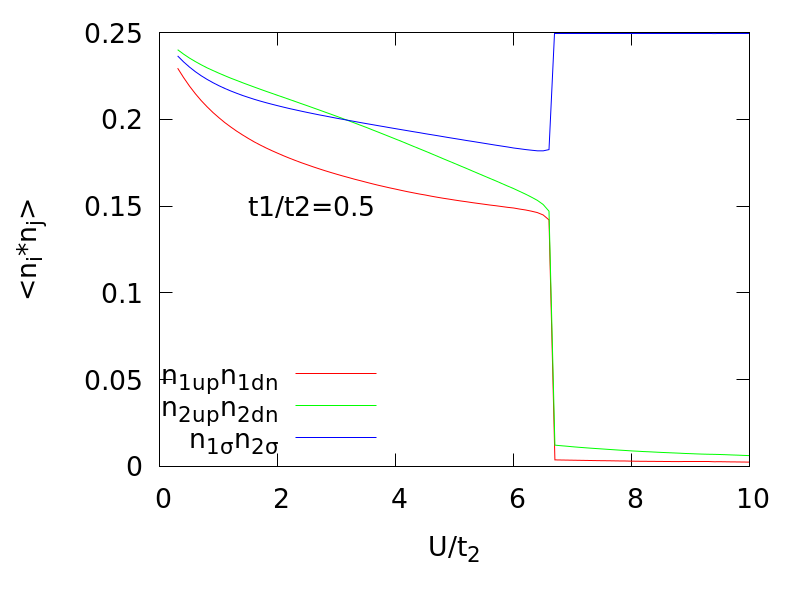
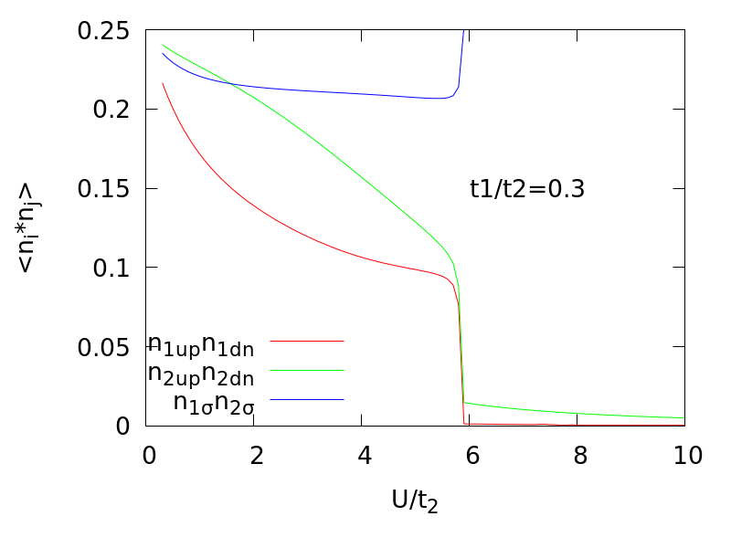
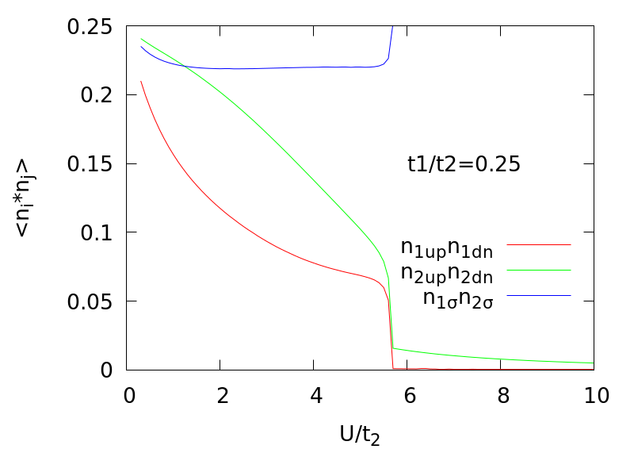
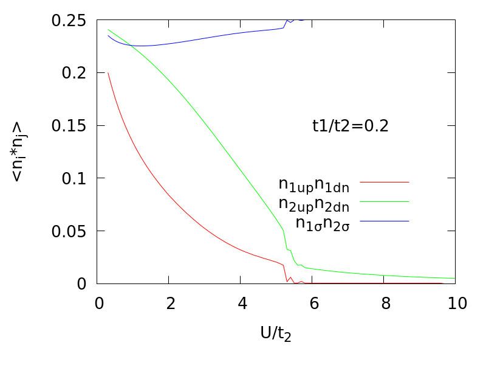
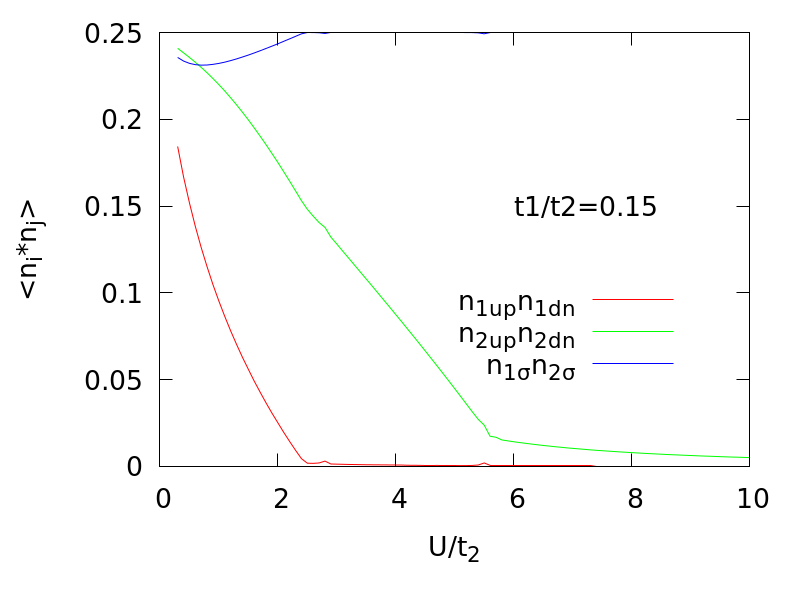
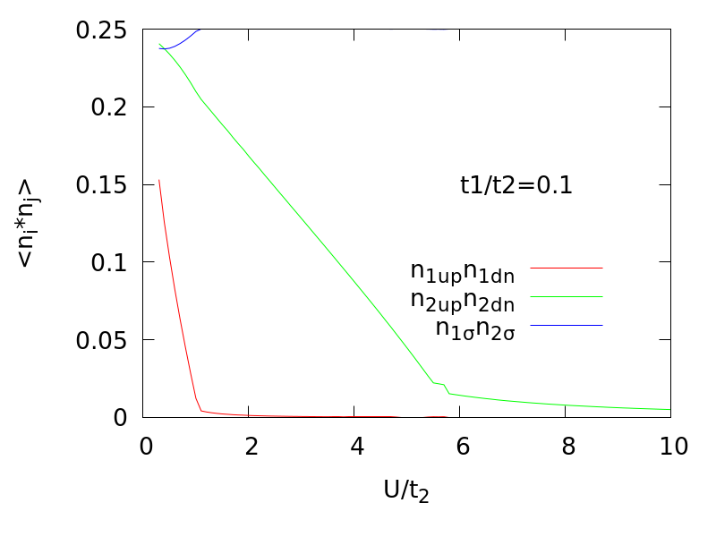

